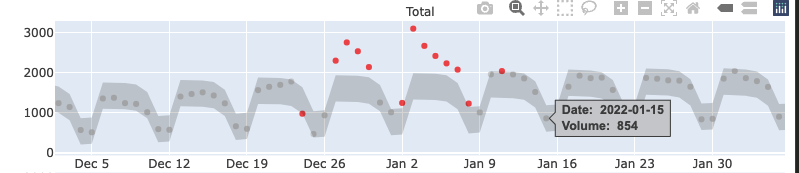
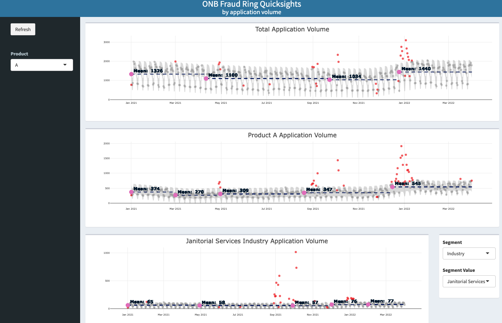

```{css, echo=FALSE}
.tiny {
  font-size: 75%;
}

.large {
  font-size: 125%;
}

/* Code line in both boxes */ 
.remark-code * {
 background: #f0f0f0;
}

```

# Research Question
**Topic**:   Detecting Fraud in Financial Services Applications over time

**Question**:  What statistical methods can differentiate fraud events from other time series anomalies and behaviors?

**Motivation**.  
As a leader in Risk Analytics at Intuit, finding new ways to identify and monitor fraudulent behavior is critical in mitigating losses. We want to be able to not only stop fraudulent transactions and activity, but detect and prevent fraud before a customer even transacts and losses are incurred.

E-Commerse fraud has been growing since the pandemic, with a reported $41 Billion in losses for 2022, and a projected $48 Billion in losses for 2023. @Baluch2023Feb.

---
# Getting Data. 

Here is a sample of the kind of data we may (or may not) work with at Intuit.

```{r packages, echo = FALSE, message = FALSE}
if (!require("pacman")) install.packages("pacman")
#install.packages("remotes")
#remotes::install_github("ropensci/RefManageR")
#devtools::install_github("business-science/sweep")
#devtools::install_github("business-science/anomalize")
#devtools::install_github("twitter/BreakoutDetection")
pacman::p_load(devtools,anomalize,timetk,plotly,formattable,
               lubridate,gghighlight,tidyquant,IntervalSurgeon,remotes,
               shiny,DT,shinydashboard,sparklyr,tidyr,BreakoutDetection,
               tidyverse,zoo,lifecycle,tibbletime,tsfeatures,feasts,
               roll,gridExtra,cowplot,knitr,xts,xaringan)
```

```{r df,echo = FALSE}
df <- read.csv(file = 'fakedata.csv') %>% as_tibble() %>% tidyr::complete(dt,product,industry) 
df[is.na(df)] <- 0
df$dt <- as.Date(df$dt,format="%m/%d/%y")
```

```{r results='asis',echo = FALSE}
print(knitr::kable(head(df),format = 'html'))
```

---
#  Exploratory Data Analysis
.pull-left[
When plotting application volume over time, we see a clear weekly seasonal component, shifts in the mean over larger spans of time, as well as point anomalies.

Total application volume consists of daily aggregated applications for Product A and Product B across all Industries. If there is a vulnerability for fraud, will it appear in the aggregate or individual time series? We see similar patterns in the individual time series for seasonality and mean shifts, but differences in the point anomaly spikes. 
]

.pull-right[
```{r fig,fig.height = 2, echo=FALSE,message=FALSE}
df %>% dplyr::group_by(dt) %>% dplyr::summarise(apps = sum(apps),.groups = 'drop') %>%
ggplot(aes(x = dt, y = apps)) +
    geom_line(col = "darkslategrey") +
    theme_minimal() + xlab("") + ylab("") + labs(title = "Total Application Volume")
```

```{r fig2,fig.height = 4, fig.width = 10, echo=FALSE,message = FALSE}
#p1 <- 
df %>% dplyr::group_by(dt,product) %>% dplyr::summarise(apps = sum(apps),.groups = 'drop') %>% 
  ggplot(aes(x = dt, y = apps)) +
    geom_line(aes(col = product)) +   
    theme_minimal() + xlab("") + ylab("") + labs(title = "Application Volume by Product") +
    theme(legend.text = element_text(size=8),legend.title = element_text(size=0), 
          legend.box = "horizontal",
          legend.key.size = unit(0.3, "cm"),
          legend.position = "bottom",
          legend.margin= margin(r=.2),
          axis.text.x=element_text(size = 9,margin=margin(r=0)),
          axis.text.y=element_text(size = 9,margin=margin(r=0)))

#p2 <- 
  df %>% dplyr::group_by(dt,industry) %>% dplyr::summarise(apps = sum(apps),.groups = 'drop') %>% 
  ggplot(aes(x = dt, y = apps)) +
    geom_line(aes(col = industry)) +   
    theme_minimal() + xlab("")  + ylab("") + labs(title = "Application Volume by Industry") +
    theme(legend.text = element_text(size=8),legend.title = element_text(size=0), 
          legend.box = "horizontal",
          legend.key.size = unit(0.3, "cm"),
          legend.position = "bottom",
          legend.margin= margin(r=.2),
          axis.text.x=element_text(size = 9,margin=margin(r=0)),
          axis.text.y=element_text(size = 9,margin=margin(r=0)))
```
]

---
# Methodology
*high level explanation of methodology

---
# Decomposition Methods

Since we observed season and trend in the dataset, the next step is to determine whether to use additive or multiplicative decomposition. Additive decomposition means the time series is a sum of it's components, while multiplicative implies it is a product of it's components. An additive model produces better results when the seasonal variation is relatively constant, whereas a multiplicative model is more useful when the seasonal variation increases over time. 

STL decomposition uses LOESS to perform smoothing on the time series in 2 loops. In the inner loop, the seasonal component is calculated and removed, then the trend component is found. The outer loop minimizes the effect of outliers. The remainder gives is found by subtracting the the seasonal and trend components. @BibEntry2016Aug

For the application to fraudulent activity, we are interested in the remainder.

---
# STL Decomposition
The seasonality of applications is weekly, most application activity occurs on weekdays than weekends. Usually if a seasonal pattern exists, we see an oscillating wave pattern. In this case, we chose a 7 day period and a periodic window to find the seasonality component. The periodic window was chosen because the same seasonal pattern repeats across the entire time span of the data set.  

```{r td,message=FALSE,warning=FALSE}
# grouping data as sum of applications by day
df_grp <- df %>% dplyr::group_by(dt) %>% 
  dplyr::summarise(apps = sum(apps),.groups = 'drop') %>% as_tbl_time(dt)
# decomposing data
td <- df_grp %>% time_decompose(apps, method = "stl")
```
.pull-left[
```{r tdp,message=FALSE,warning=FALSE,echo = FALSE}
knitr::kable(head(td)) %>%
  kableExtra::kable_styling(font_size = 7)
```
]

.pull-right[
```{r td_plot,fig.height = 3,message = FALSE,warning=FALSE,echo=FALSE}
df_grp %>% as_tsibble() %>% 
  model(STL(apps ~ season(window = "periodic", period = '7 days') + trend(window= 90.5), robust = TRUE)) %>%   
  components() %>% autoplot()
```
]
---
# STL Decomposition by Attribute
When we look at the time series decompositions for products A and B separately,the seasonal and trend components have similar shapes as the aggregate, but the noise we see in the remainder closely mirroring the noise in the aggregate. 

Most fraudulent activity at the application level is a product of bots creating several applications with the intent to defraud the company or buyer. We want to find the clusters within a time series to find the attributes that can tell us the exact products, industries, etc. the fraudulent applications are targeting. By taking out seasonal and trend components, we can compare the noise in the remainder to the aggregate to target high-risk fraud attacks. 

.pull-left[
```{r td_plot2,fig.height = 3,echo=FALSE,message = FALSE}
df %>% dplyr::group_by(dt,product) %>% dplyr::summarise(apps = sum(apps),.groups = 'drop') %>%
   as_tbl_time(dt)  %>% filter(product == 'A') %>% select(dt,apps) %>% as_tsibble() %>% 
  model(STL(apps ~ season(window = "periodic", period = '7 days') + trend(window= 90.5), robust = TRUE)) %>%   
  components() %>% autoplot() + labs(title="STL Decomposition: Product A")
```
]

.pull-right[
```{r td_plot22,fig.height = 3,echo=FALSE,message = FALSE}
df %>% dplyr::group_by(dt,product) %>% dplyr::summarise(apps = sum(apps),.groups = 'drop') %>%
   as_tbl_time(dt)  %>% filter(product == 'B') %>% select(dt,apps) %>% as_tsibble() %>% 
  model(STL(apps ~ season(window = "periodic", period = '7 days') + trend(window= 90.5), robust = TRUE)) %>%   
  components() %>% autoplot() + labs(title="STL Decomposition: Product B")
```
]
---
# Identifying Outliers in the STL Remainder
Now that we've decomposed the time series, we want to detect the outliers. To do this, we chose to use the GESD Method.

The GESD Method (Generlized Extreme Studentized Deviate Test) progressively eliminates outliers using a Student's T-Test comparing the test statistic to a critical value. Each time an outlier is removed, the test statistic is updated. Once test statistic drops below the critical value, all outliers are considered removed. (from anomalize documentation) @Rosner1983May

```{r anom,message = FALSE,warning = FALSE}
a <- td %>% anomalize(remainder, method = "gesd") 
df_anom <- a %>% time_recompose()

knitr::kable(head(df_anom)) %>%
  kableExtra::kable_styling(font_size = 7)
```


```{r anom2,echo=FALSE,message=FALSE,warning = FALSE}
fcn_anom <- function(dat){
  dat %>%
    # Data Manipulation / Anomaly Detection43
    time_decompose(apps, method = "stl") %>%
    anomalize(remainder, method = "gesd",alpha = .1) %>%
    time_recompose()
}

dat1 <- df %>% dplyr::group_by(dt,product) %>% dplyr::summarise(apps = sum(apps),.groups = 'drop') %>%
   as_tbl_time(dt)  %>% filter(product == 'A') %>% select(dt,apps)
dat2 <- df %>% dplyr::group_by(dt,product) %>% dplyr::summarise(apps = sum(apps),.groups = 'drop') %>%
   as_tbl_time(dt)  %>% filter(product == 'B') %>% select(dt,apps)
dat3 <- df %>% dplyr::group_by(dt,industry) %>% dplyr::summarise(apps = sum(apps),.groups = 'drop') %>%
   as_tbl_time(dt)  %>% filter(industry == 'Janitorial Services') %>% select(dt,apps)

prod_a <- fcn_anom(dat1)
prod_b <- fcn_anom(dat2)
prod_c <- fcn_anom(dat3)

```
---
# Visualizing Outliers
When we plot the application volume series with the outliers and limits, at first glance it looks like there 2 distinct time series in each plot... this is a result of the weekly seasonality we observed when decomposing the series.

```{r anomp,fig.height = 4.5,fig.width=8,echo=FALSE,message = FALSE,warning = FALSE}
figp1 <- plot_ly(df_anom, type = 'scatter', mode = "markers+lines", colors = c(alpha("grey",.01),"red2")) %>%
    
    add_trace(x = ~dt, y = ~observed, mode = "markers", color = ~anomaly,alpha = .7,
              text = ~paste('</br><b> Date: ', dt,
                            '</br> Volume: ', observed, '</b>'
              ),
              
              hoverinfo = 'text',hoverlabel = list(font=list(size=12.5))) %>%
    
    add_trace(x= ~dt, y = ~recomposed_l2, 
              mode = "lines",fill = 'tonexty', fillcolor= 'rgba(0, 0, 0, 0.15)', 
              line = list(color = 'transparent'), showlegend = FALSE)%>%
    
    add_trace(x= ~dt, y = ~recomposed_l1, 
              mode = "lines",fill = 'tonexty', fillcolor='rgba(0, 0, 0, 0.15)', 
              line = list(color = 'transparent'), showlegend = FALSE) %>%
    layout(showlegend = F, 
           xaxis = list(rangeslider = list(visible = F),title = FALSE, tickfont = list(size = 6)),
           yaxis = list(title = FALSE, tickfont = list(size = 6)),
            plot_bgcolor = "white",
         paper_bgcolor = "white",
         gridcolor = 'white')

figp2 <- plot_ly(prod_a, type = 'scatter', mode = "markers+lines", colors = c(alpha("grey",.01),"red2")) %>%
    
    add_trace(x = ~dt, y = ~observed, mode = "markers", color = ~anomaly,alpha = .7,
              text = ~paste('</br><b> Date: ', dt,
                            '</br> Volume: ', observed, '</b>'
              ),
              
              hoverinfo = 'text',hoverlabel = list(font=list(size=12.5))) %>%
    
    add_trace(x= ~dt, y = ~recomposed_l2, 
              mode = "lines",fill = 'tonexty', fillcolor= 'rgba(0, 0, 0, 0.15)', 
              line = list(color = 'transparent'), showlegend = FALSE)%>%
    
    add_trace(x= ~dt, y = ~recomposed_l1, 
              mode = "lines",fill = 'tonexty', fillcolor='rgba(0, 0, 0, 0.15)', 
              line = list(color = 'transparent'), showlegend = FALSE) %>%
    layout(showlegend = F, 
           xaxis = list(rangeslider = list(visible = F),title = FALSE, tickfont = list(size = 6)),
           yaxis = list(title = FALSE, tickfont = list(size = 6)),
            plot_bgcolor = "white",
         paper_bgcolor = "white",
         gridcolor = 'white')

figp3 <- plot_ly(prod_b, type = 'scatter', mode = "markers+lines", colors = c(alpha("grey",.01),"red2")) %>%
    
    add_trace(x = ~dt, y = ~observed, mode = "markers", color = ~anomaly,alpha = .7,
              text = ~paste('</br><b> Date: ', dt,
                            '</br> Volume: ', observed, '</b>'
              ),
              
              hoverinfo = 'text',hoverlabel = list(font=list(size=12.5))) %>%
    
    add_trace(x= ~dt, y = ~recomposed_l2, 
              mode = "lines",fill = 'tonexty', fillcolor= 'rgba(0, 0, 0, 0.15)', 
              line = list(color = 'transparent'), showlegend = FALSE)%>%
    
    add_trace(x= ~dt, y = ~recomposed_l1, 
              mode = "lines",fill = 'tonexty', fillcolor='rgba(0, 0, 0, 0.15)', 
              line = list(color = 'transparent'), showlegend = FALSE) %>%
    layout(showlegend = F, 
           xaxis = list(rangeslider = list(visible = F),title = FALSE, tickfont = list(size = 6)),
           yaxis = list(title = FALSE, tickfont = list(size = 6)),
            plot_bgcolor = "white",
         paper_bgcolor = "white",
         gridcolor = 'white')

fig <- subplot(figp1, figp2, figp3, nrows = 3)

annotations = list( 
  list( 
    x = 0.5,  
    y = 1.0,  
    text = "Total",  
    xref = "paper",  
    yref = "paper",  
    xanchor = "center",  
    yanchor = "bottom",  
    showarrow = FALSE 
  ),  
  list( 
    x = 0.5,  
    y = .6,  
    text = "Product A",  
    xref = "paper",  
    yref = "paper",  
    xanchor = "center",  
    yanchor = "bottom",  
    showarrow = FALSE 
  ),  
  list( 
    x = 0.5,  
    y = 0.28,  
    text = "Product B",  
    xref = "paper",  
    yref = "paper",  
    xanchor = "center",  
    yanchor = "bottom",  
    showarrow = FALSE 
  ))

fig <- fig %>%layout(annotations = annotations) 
#options(warn = -1)
fig
```

---
# Closer Look...

If we look closer, we notice distinctly different behavior on weekends vs. weekdays.

```{r viz,echo=FALSE}

```

```{r groupingfcns,echo=FALSE,message = FALSE,include = FALSE}
## Anomaly Detection
 # outputs anomaly, trend, seasonality, direction, expected value

## Find location of mean shifts
fcn_break_loc <- function(dat){
  break_loc <- select(dat,timestamp = dt,count = trend) 
  break_loc <- breakout(break_loc,min.size=60, method='multi', beta=.001, degree=1, plot=FALSE)$loc
  break_loc
}

## Find means grouped by mean shift
fcn_break_mean <- function(dat,dat2){
  break_loc <- fcn_break_loc(dat2)
  dat <- dat %>% mutate(trend_bk = ifelse(index %in% break_loc,1,0))
  dat <- dat %>% mutate(bk_index = cumsum(trend_bk) + 1)
  
  start <- dat$dt[break_loc]
  start <- c(min(dat$dt),start)
  end <- lead(start,1)
  end <- end[-NROW(end)]
  end <- c(end,max(dat$dt))
  c <- data.frame(start,end)
  c$bk_index <- index(c)
  
  b2 <- dat %>%
    filter(anomaly == "No") %>%
    dplyr::group_by(bk_index) %>%
    dplyr::summarize(mean = mean(observed)) 
  b2 <- merge(b2, c, all.x = TRUE, by.x = "bk_index", by.y = "bk_index") %>% as_tibble()
  
  merge(dat,b2,all.x = TRUE,by.x=c("bk_index"),by.y=c("bk_index")) %>% as_tibble()
}


df_anom <- df_anom %>% mutate(index = index(dt))
prod_a <- prod_a %>% mutate(index = index(dt))
prod_b <- prod_b %>% mutate(index = index(dt))
prod_c <- prod_c %>% mutate(index = index(dt))
df_anom2 <-  fcn_break_mean(df_anom,df_anom)
df_anomp1 <-  fcn_break_mean(prod_a,prod_a)
df_anomp2 <-  fcn_break_mean(prod_b,prod_b)
df_anomp3 <-  fcn_break_mean(prod_c,prod_c)
```

```{r alldatasets, echo = FALSE,include = FALSE}
ff <- plot_ly(df_anom2, type = 'scatter', mode = "markers+lines", colors = c(alpha("grey",.01),"red2")) %>%
    
    add_trace(x = ~dt, y = ~observed, mode = "markers", color = ~anomaly,alpha = .7,
              text = ~paste('</br><b> Date: ', dt,
                            '</br> Volume: ', observed, '</b>'
              ),
              
              hoverinfo = 'text',hoverlabel = list(font=list(size=12.5))) %>%
    
    add_trace(x= ~dt, y = ~recomposed_l2, 
              mode = "lines",fill = 'tonexty', fillcolor= 'rgba(0, 0, 0, 0.15)', 
              line = list(color = 'transparent'), showlegend = FALSE)%>%
    
    add_trace(x= ~dt, y = ~recomposed_l1, 
              mode = "lines",fill = 'tonexty', fillcolor='rgba(0, 0, 0, 0.15)', 
              line = list(color = 'transparent'), showlegend = FALSE) %>%
  
   add_segments(x = ~df_anom2$start, xend = ~df_anom2$end, y = ~df_anom2$mean, yend = ~df_anom2$mean, line = list(color = 'rgba(0, 25, 100, .4)',width = 1.3,dash = "dash")) %>%
    
    add_markers(~df_anom2$start,~df_anom2$mean, size = 1, symbol = 1,text = ~paste('Mean: ', df_anom2$mean),hoverinfo = 'text') %>%
    add_annotations(x = ~df_anom2$start,y = ~df_anom2$mean,
                    text = ~paste('<b> Mean: ', round(df_anom2$mean,0)),
                    font = list(size = 12,color = 'rgba(0, 25, 51, 1)'),
                    xanchor = 'left',
                    showarrow = FALSE,
                    yanchor = "bottom") %>%
  
    layout(showlegend = F, title = list(text = "Total Application Volume"),
           xaxis = list(rangeslider = list(visible = F),title = FALSE, tickfont = list(size = 7)),
           yaxis = list(title = FALSE, tickfont = list(size = 7)),
            plot_bgcolor = "white",
         paper_bgcolor = "white",
         gridcolor = 'white')

ff2 <- plot_ly(df_anomp1, type = 'scatter', mode = "markers+lines", colors = c(alpha("grey",.01),"red2")) %>%
    
    add_trace(x = ~dt, y = ~observed, mode = "markers", color = ~anomaly,alpha = .7,
              text = ~paste('</br><b> Date: ', dt,
                            '</br> Volume: ', observed, '</b>'
              ),
              
              hoverinfo = 'text',hoverlabel = list(font=list(size=12.5))) %>%
    
    add_trace(x= ~dt, y = ~recomposed_l2, 
              mode = "lines",fill = 'tonexty', fillcolor= 'rgba(0, 0, 0, 0.15)', 
              line = list(color = 'transparent'), showlegend = FALSE)%>%
    
    add_trace(x= ~dt, y = ~recomposed_l1, 
              mode = "lines",fill = 'tonexty', fillcolor='rgba(0, 0, 0, 0.15)', 
              line = list(color = 'transparent'), showlegend = FALSE) %>%
  
   add_segments(x = ~df_anomp1$start, xend = ~df_anomp1$end, y = ~df_anomp1$mean, yend = ~df_anomp1$mean, line = list(color = 'rgba(0, 25, 100, .4)',width = 1.3,dash = "dash")) %>%
    
    add_markers(~df_anomp1$start,~df_anomp1$mean, size = 1, symbol = 1,text = ~paste('Mean: ', df_anomp1$mean),hoverinfo = 'text') %>%
    add_annotations(x = ~df_anomp1$start,y = ~df_anomp1$mean,
                    text = ~paste('<b> Mean: ', round(df_anomp1$mean,0)),
                    font = list(size = 12,color = 'rgba(0, 25, 51, 1)'),
                    xanchor = 'left',
                    showarrow = FALSE,
                    yanchor = "bottom") %>%
  
    layout(showlegend = F, title = list(text = "Product A Application Volume"),
           xaxis = list(rangeslider = list(visible = F),title = FALSE, tickfont = list(size = 7)),
           yaxis = list(title = FALSE, tickfont = list(size = 7)),
            plot_bgcolor = "white",
         paper_bgcolor = "white",
         gridcolor = 'white')


ff3 <- plot_ly(df_anomp2, type = 'scatter', mode = "markers+lines", colors = c(alpha("grey",.01),"red2")) %>%
    
    add_trace(x = ~dt, y = ~observed, mode = "markers", color = ~anomaly,alpha = .7,
              text = ~paste('</br><b> Date: ', dt,
                            '</br> Volume: ', observed, '</b>'
              ),
              
              hoverinfo = 'text',hoverlabel = list(font=list(size=12.5))) %>%
    
    add_trace(x= ~dt, y = ~recomposed_l2, 
              mode = "lines",fill = 'tonexty', fillcolor= 'rgba(0, 0, 0, 0.15)', 
              line = list(color = 'transparent'), showlegend = FALSE)%>%
    
    add_trace(x= ~dt, y = ~recomposed_l1, 
              mode = "lines",fill = 'tonexty', fillcolor='rgba(0, 0, 0, 0.15)', 
              line = list(color = 'transparent'), showlegend = FALSE) %>%
  
   add_segments(x = ~df_anomp2$start, xend = ~df_anomp2$end, y = ~df_anomp2$mean, yend = ~df_anomp2$mean, line = list(color = 'rgba(0, 25, 100, .4)',width = 1.3,dash = "dash")) %>%
    
    add_markers(~df_anomp2$start,~df_anomp2$mean, size = 1, symbol = 1,text = ~paste('Mean: ', df_anomp2$mean),hoverinfo = 'text') %>%
    add_annotations(x = ~df_anomp2$start,y = ~df_anomp2$mean,
                    text = ~paste('<b> Mean: ', round(df_anomp2$mean,0)),
                    font = list(size = 12,color = 'rgba(0, 25, 51, 1)'),
                    xanchor = 'left',
                    showarrow = FALSE,
                    yanchor = "bottom") %>%
  
    layout(showlegend = F, title = list(text = "Product B Application Volume"),
           xaxis = list(rangeslider = list(visible = F),title = FALSE, tickfont = list(size = 7)),
           yaxis = list(title = FALSE, tickfont = list(size = 7)),
            plot_bgcolor = "white",
         paper_bgcolor = "white",
         gridcolor = 'white')

ff4 <- plot_ly(df_anomp3, type = 'scatter', mode = "markers+lines", colors = c(alpha("grey",.01),"red2")) %>%
    
    add_trace(x = ~dt, y = ~observed, mode = "markers", color = ~anomaly,alpha = .7,
              text = ~paste('</br><b> Date: ', dt,
                            '</br> Volume: ', observed, '</b>'
              ),
              
              hoverinfo = 'text',hoverlabel = list(font=list(size=12.5))) %>%
    
    add_trace(x= ~dt, y = ~recomposed_l2, 
              mode = "lines",fill = 'tonexty', fillcolor= 'rgba(0, 0, 0, 0.15)', 
              line = list(color = 'transparent'), showlegend = FALSE)%>%
    
    add_trace(x= ~dt, y = ~recomposed_l1, 
              mode = "lines",fill = 'tonexty', fillcolor='rgba(0, 0, 0, 0.15)', 
              line = list(color = 'transparent'), showlegend = FALSE) %>%
  
   add_segments(x = ~df_anomp3$start, xend = ~df_anomp3$end, y = ~df_anomp3$mean, yend = ~df_anomp3$mean, line = list(color = 'rgba(0, 25, 100, .4)',width = 1.3,dash = "dash")) %>%
    
    add_markers(~df_anomp3$start,~df_anomp3$mean, size = 1, symbol = 1,text = ~paste('Mean: ', df_anomp3$mean),hoverinfo = 'text') %>%
    add_annotations(x = ~df_anomp3$start,y = ~df_anomp3$mean,
                    text = ~paste('<b> Mean: ', round(df_anomp3$mean,0)),
                    font = list(size = 12,color = 'rgba(0, 25, 51, 1)'),
                    xanchor = 'left',
                    showarrow = FALSE,
                    yanchor = "bottom") %>%
  
    layout(showlegend = F, title = list(text = "Janitorial Services Industry Application Volume"),
           xaxis = list(rangeslider = list(visible = F),title = FALSE, tickfont = list(size = 7)),
           yaxis = list(title = FALSE, tickfont = list(size = 7)),
            plot_bgcolor = "white",
         paper_bgcolor = "white",
         gridcolor = 'white')


```
---
# Findings and Results
We applied this method at scale, iterating across dozens of attributes, and deployed an R Shiny interactive dashboard hosted in Databricks for stakeholders within risk to monitor and quickly identify and target fraudulent behavior.

We also included tabs with insights into the trend and seasonal components, linking fraud data to marketing and customer growth data to explain large shifts in mean, and differentiate those from fraud anomalies. The simplicity of this method makes it easy to explain and share, but there are opportunities to enhance it even further...

```{r,echo=FALSE,fig.height = 4,fig.width=6}

```
---
# Future Work
* Find the clusters of fraud. We were able to iterate time series decomposition and anomaly detection across several time series within the aggregate, but what are the specific profiles of applications that cause fraud events? Are there other statistical methods and tools that would could combine with this method to find what clusters of channels fraudulent applications are coming through?

* Another big opportunity we've started exploring is the link between fraudulent applications and marketing. How can we compound our savings, and optimize our marketing budget by looking at whether increases in customer growth from marketing campaigns are actually bad actors causing losses?
---
# References

