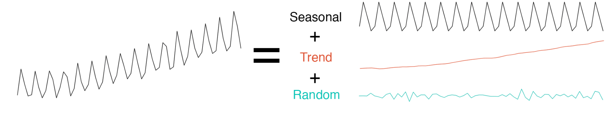
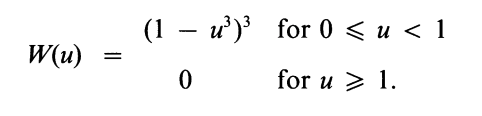
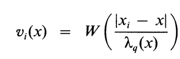

```{css, echo = FALSE}
.tiny {
  font-size: 75%;
}

.small {
  font-size: 85%;
}

.small2 {
  font-size: 94%;
}

.med {
  font-size: 110%;
}

.large {
  font-size: 125%;
}

.larger {
  font-size: 140%;
}

/* Code line in both boxes */ 
.remark-code * {
 background: #f0f0f0;
}

.pull-left-big {
  float: left;
  width: 52%;
}

.pull-right-small {
  float: right;
  width: 41%;
}

```

# Background and Motivation
E-Commerce fraud has been growing since the pandemic, with a reported **$41 Billion in losses for 2022** @Baluch2023Feb.

.med[**Goal:** Detect Fraud in Financial Services Applications over time to detect and prevent fraud before a customer even transacts and losses are incurred]

.center[
```{r vizmeme, out.width="45%", echo=FALSE}

```
]
---
# Fraud Detection Challenges
.large[
- Typical fraud attack: bots create several applications with the intent to defraud the company or buyer

- Application volume can be an early indicator of potential fraud attacks, but how do we know if shifts in volume are due to fraud, normal growth, marketing trends, or seasonality?

- Where is the fraud coming from?
]
---
# The Data 

.center[.large[Here is a sample of the kind of data we may (or may not) work with at Intuit:]]

```{r packages, echo = FALSE, message = FALSE}
if (!require("pacman")) install.packages("pacman")
#install.packages("remotes")
#remotes::install_github("ropensci/RefManageR")
#devtools::install_github("business-science/sweep")
#devtools::install_github("business-science/anomalize")
#devtools::install_github("twitter/BreakoutDetection")
pacman::p_load(devtools,anomalize,timetk,plotly,formattable,
               lubridate,gghighlight,tidyquant,IntervalSurgeon,
               shiny,DT,tidyr,BreakoutDetection,
               tidyverse,zoo,lifecycle,tibbletime,tsfeatures,feasts,
               roll,gridExtra,cowplot,knitr,xts,xaringan)
```

```{r df,echo = FALSE}
df <- read.csv(file = 'fakedata.csv') %>% as_tibble() %>% tidyr::complete(dt,product,industry) 
df[is.na(df)] <- 0
df$dt <- as.Date(df$dt,format="%m/%d/%y")
```

```{r results='asis',echo = FALSE}
print(knitr::kable(head(df),format = 'html'))
```

---
#  .small[Exploring the Data: Aggregated Application Volume]
- Total daily application volume shows a clear **weekly seasonal component**, **shifts in the mean** over larger spans of time, as well as **point anomalies**.
- Total application volume consists of daily aggregated applications for Product A and Product B across all Industries

.center[
```{r fig,fig.height = 5, fig.width = 10, echo=FALSE,message=FALSE}
df %>% dplyr::group_by(dt) %>% dplyr::summarise(apps = sum(apps),.groups = 'drop') %>%
ggplot(aes(x = dt, y = apps)) +
    geom_line(col = "darkslategrey") +
    theme_minimal() + xlab("") + ylab("") + labs(title = "Total Application Volume")
```
]

---
#  .small[Exploring the Data: Application Volume by Attribute]
We see similar patterns in the individual time series for seasonality and mean shifts, but differences in the point anomaly spikes

.center[
```{r fig2,fig.height = 3.7, fig.width = 13, echo=FALSE,message = FALSE}
#p1 <- 
df %>% dplyr::group_by(dt,product) %>% dplyr::summarise(apps = sum(apps),.groups = 'drop') %>% 
  ggplot(aes(x = dt, y = apps)) +
    geom_line(aes(col = product)) +   
    theme_minimal() + xlab("") + ylab("") + labs(title = "Application Volume by Product") +
    theme(legend.text = element_text(size=8),legend.title = element_text(size=0), 
          legend.box = "horizontal",
          legend.key.size = unit(0.3, "cm"),
          legend.position = "bottom",
          legend.margin= margin(r=.2),
          axis.text.x=element_text(size = 9,margin=margin(r=0)),
          axis.text.y=element_text(size = 9,margin=margin(r=0)))

#p2 <- 
  df %>% dplyr::group_by(dt,industry) %>% dplyr::summarise(apps = sum(apps),.groups = 'drop') %>% 
  ggplot(aes(x = dt, y = apps)) +
    geom_line(aes(col = industry)) +   
    theme_minimal() + xlab("")  + ylab("") + labs(title = "Application Volume by Industry") +
    theme(legend.text = element_text(size=8),legend.title = element_text(size=0), 
          legend.box = "horizontal",
          legend.key.size = unit(0.3, "cm"),
          legend.position = "bottom",
          legend.margin= margin(r=.2),
          axis.text.x=element_text(size = 9,margin=margin(r=0)),
          axis.text.y=element_text(size = 9,margin=margin(r=0)))
```
]

---
# Methodology
Decompose time series and identify outliers on remainder. Iterate over individual attribute and apply anomaly detection to the unaggregated data set.

1. Decompose time series into Trend, Seasonality, Remainder
  + STL: Seasonal Decomposition of Time Series by Loess
  + anomalize package <br><br>
2. Identify Outliers in the Remainder
  + GESD: Generalized Extreme Studentized Deviate Test <br>

.center[
```{r vizmet,fig.height = 4, out.width="90%", echo=FALSE}

```
] 
---
# Time Series Decomposition
**STL decomposition: uses LOESS to perform smoothing on the time series in 2 loops**
- Inner Loop - seasonal component calculated and removed, trend component is found
- Outer Loop - minimizes the effect of outliers
- Remainder is found by subtracting seasonal and trend components

**LOESS (locally re-weighted scatter plot smoothing) non-parametric regression**
.small2[.pull-left[
- Weighted least squares used to fit linear or quadratic functions of the predictors at the center of local neighborhoods

- Data points in local neighborhood weighted by smooth decreasing function of their distance from the
center of the neighborhood (euclidean distance)]]

.pull-right[.center[.small2[Weights are defined by the tri-cube function W]]

.center[
```{r t,out.width="50%", echo=FALSE}

```
]

.center[.small2[
$$
\begin{align}
    \text{Neighborhood weight of any}\ x_i
\end{align}
$$
]]
.center[
```{r loca,out.width="40%", echo=FALSE}

```
]]

---
# Applying STL Decomposition
```{r td,message=FALSE,warning=FALSE}
# grouping data as sum of applications by day
df_grp <- df %>% dplyr::group_by(dt) %>% 
  dplyr::summarise(apps = sum(apps),.groups = 'drop') %>% as_tbl_time(dt)
# decomposing data
td <- df_grp %>% time_decompose(apps, method = "stl")
```

.pull-left-big[
```{r td_plot,fig.height=5,message = FALSE,warning=FALSE,echo=FALSE}
df_grp %>% as_tsibble() %>% 
  model(STL(apps ~ season(window = "periodic", period = '7 days') + trend(window= 90.5), robust = TRUE)) %>%   
  components() %>% autoplot()
```
]
.pull-right-small[
<br>
```{r tdp,message=FALSE,out.width="110%",warning=FALSE,echo = FALSE}
knitr::kable(head(td)) %>%
  kableExtra::kable_styling(font_size = 12)
```
]

---
# STL Observations
.center[
```{r ,message = FALSE,fig.height = 4.8, warning=FALSE,echo=FALSE,include = FALSE}
weekDays <- c( "F", "Sa","Su", "M", "Tu","W", "Th")
library(stlplus)
df_grp <- df %>% dplyr::group_by(dt) %>% 
  dplyr::summarise(apps = sum(apps),.groups = 'drop') %>% as_tbl_time(dt)
# decomposing data
td <- df_grp %>% time_decompose(apps, method = "stl")
```

```{r ,message = FALSE,fig.height = 4.8, fig.width = 8, warning=FALSE}
stlDaily <- stlplus(df_grp$apps,t=df_grp$dt,
                    n.p=7, s.window=25,
                    sub.labels=weekDays, sub.start=1)

plot_cycle(stlDaily,ylab="Weekly Seasonality")
```
]
---
# STL Decomposition by Attribute
Seasonal & trend components have similar shapes as the aggregate, by taking out seasonal & trend components, we can compare noise in remainder to aggregate and target high-risk fraud attacks

.pull-left[
```{r td_plot2,echo=FALSE,message = FALSE}
df %>% dplyr::group_by(dt,product) %>% dplyr::summarise(apps = sum(apps),.groups = 'drop') %>%
   as_tbl_time(dt)  %>% filter(product == 'A') %>% select(dt,apps) %>% as_tsibble() %>% 
  model(STL(apps ~ season(window = "periodic", period = '7 days') + trend(window= 90.5), robust = TRUE)) %>%   
  components() %>% autoplot() + labs(title="STL Decomposition: Product A")
```
]
.pull-right[
```{r td_plot22,echo=FALSE,message = FALSE}
df %>% dplyr::group_by(dt,product) %>% dplyr::summarise(apps = sum(apps),.groups = 'drop') %>%
   as_tbl_time(dt)  %>% filter(product == 'B') %>% select(dt,apps) %>% as_tsibble() %>% 
  model(STL(apps ~ season(window = "periodic", period = '7 days') + trend(window= 90.5), robust = TRUE)) %>%   
  components() %>% autoplot() + labs(title="STL Decomposition: Product B")
```
]
---
# Identifying Outliers in the STL Remainder
- The GESD Method (Generlized Extreme Studentized Deviate Test) progressively eliminates outliers using a Student's T-Test comparing the test statistic to a critical value
- Each time an outlier is removed, the test statistic is updated. Once test statistic drops below the critical value, all outliers are considered removed. (from anomalize documentation) @Rosner1983May

```{r anom,message = FALSE,warning = FALSE}
a <- td %>% anomalize(remainder, method = "gesd") 
df_anom <- a %>% time_recompose()
```

```{r anom_p,message = FALSE,warning = FALSE,echo = FALSE}
knitr::kable(head(df_anom)) %>%
  kableExtra::kable_styling(font_size = 12)
```

```{r anom2,echo=FALSE,message=FALSE,warning = FALSE}
fcn_anom <- function(dat){
  dat %>%
    # Data Manipulation / Anomaly Detection43
    time_decompose(apps, method = "stl") %>%
    anomalize(remainder, method = "gesd",alpha = .1) %>%
    time_recompose()
}

dat1 <- df %>% dplyr::group_by(dt,product) %>% dplyr::summarise(apps = sum(apps),.groups = 'drop') %>%
   as_tbl_time(dt)  %>% filter(product == 'A') %>% select(dt,apps)
dat2 <- df %>% dplyr::group_by(dt,product) %>% dplyr::summarise(apps = sum(apps),.groups = 'drop') %>%
   as_tbl_time(dt)  %>% filter(product == 'B') %>% select(dt,apps)
dat3 <- df %>% dplyr::group_by(dt,industry) %>% dplyr::summarise(apps = sum(apps),.groups = 'drop') %>%
   as_tbl_time(dt)  %>% filter(industry == 'Janitorial Services') %>% select(dt,apps)

prod_a <- fcn_anom(dat1)
prod_b <- fcn_anom(dat2)
prod_c <- fcn_anom(dat3)

```
---
# Visualizing Outliers

.center[
```{r ff, fig.width = 9, fig.height = 6.8, echo=FALSE, message = FALSE,warning = FALSE}
figp1 <- plot_ly(df_anom, type = 'scatter', mode = "markers+lines", colors = c(alpha("grey",.01),"red2")) %>%
    
    add_trace(x = ~dt, y = ~observed, mode = "markers", color = ~anomaly,alpha = .7,
              text = ~paste('</br><b> Date: ', dt,
                            '</br> Volume: ', observed, '</b>'
              ),
              
              hoverinfo = 'text',hoverlabel = list(font=list(size=12.5))) %>%
    
    add_trace(x= ~dt, y = ~recomposed_l2, 
              mode = "lines",fill = 'tonexty', fillcolor= 'rgba(0, 0, 0, 0.15)', 
              line = list(color = 'transparent'), showlegend = FALSE)%>%
    
    add_trace(x= ~dt, y = ~recomposed_l1, 
              mode = "lines",fill = 'tonexty', fillcolor='rgba(0, 0, 0, 0.15)', 
              line = list(color = 'transparent'), showlegend = FALSE) %>%
    layout(showlegend = F, 
           xaxis = list(rangeslider = list(visible = F),title = FALSE, tickfont = list(size = 6)),
           yaxis = list(title = FALSE, tickfont = list(size = 6)),
            plot_bgcolor = "white",
         paper_bgcolor = "white",
         gridcolor = 'white')

figp2 <- plot_ly(prod_a, type = 'scatter', mode = "markers+lines", colors = c(alpha("grey",.01),"red2")) %>%
    
    add_trace(x = ~dt, y = ~observed, mode = "markers", color = ~anomaly,alpha = .7,
              text = ~paste('</br><b> Date: ', dt,
                            '</br> Volume: ', observed, '</b>'
              ),
              
              hoverinfo = 'text',hoverlabel = list(font=list(size=12.5))) %>%
    
    add_trace(x= ~dt, y = ~recomposed_l2, 
              mode = "lines",fill = 'tonexty', fillcolor= 'rgba(0, 0, 0, 0.15)', 
              line = list(color = 'transparent'), showlegend = FALSE)%>%
    
    add_trace(x= ~dt, y = ~recomposed_l1, 
              mode = "lines",fill = 'tonexty', fillcolor='rgba(0, 0, 0, 0.15)', 
              line = list(color = 'transparent'), showlegend = FALSE) %>%
    layout(showlegend = F, 
           xaxis = list(rangeslider = list(visible = F),title = FALSE, tickfont = list(size = 6)),
           yaxis = list(title = FALSE, tickfont = list(size = 6)),
            plot_bgcolor = "white",
         paper_bgcolor = "white",
         gridcolor = 'white')

figp3 <- plot_ly(prod_b, type = 'scatter', mode = "markers+lines", colors = c(alpha("grey",.01),"red2")) %>%
    
    add_trace(x = ~dt, y = ~observed, mode = "markers", color = ~anomaly,alpha = .7,
              text = ~paste('</br><b> Date: ', dt,
                            '</br> Volume: ', observed, '</b>'
              ),
              
              hoverinfo = 'text',hoverlabel = list(font=list(size=12.5))) %>%
    
    add_trace(x= ~dt, y = ~recomposed_l2, 
              mode = "lines",fill = 'tonexty', fillcolor= 'rgba(0, 0, 0, 0.15)', 
              line = list(color = 'transparent'), showlegend = FALSE)%>%
    
    add_trace(x= ~dt, y = ~recomposed_l1, 
              mode = "lines",fill = 'tonexty', fillcolor='rgba(0, 0, 0, 0.15)', 
              line = list(color = 'transparent'), showlegend = FALSE) %>%
    layout(showlegend = F, 
           xaxis = list(rangeslider = list(visible = F),title = FALSE, tickfont = list(size = 6)),
           yaxis = list(title = FALSE, tickfont = list(size = 6)),
            plot_bgcolor = "white",
         paper_bgcolor = "white",
         gridcolor = 'white')

fig <- subplot(figp1, figp2, figp3, nrows = 3)

annotations = list( 
  list( 
    x = 0.5,  
    y = 1.0,  
    text = "Total",  
    xref = "paper",  
    yref = "paper",  
    xanchor = "center",  
    yanchor = "bottom",  
    showarrow = FALSE 
  ),  
  list( 
    x = 0.5,  
    y = .6,  
    text = "Product A",  
    xref = "paper",  
    yref = "paper",  
    xanchor = "center",  
    yanchor = "bottom",  
    showarrow = FALSE 
  ),  
  list( 
    x = 0.5,  
    y = 0.28,  
    text = "Product B",  
    xref = "paper",  
    yref = "paper",  
    xanchor = "center",  
    yanchor = "bottom",  
    showarrow = FALSE 
  ))

fig <- fig %>%layout(annotations = annotations) 
#options(warn = -1)
fig
```
]

---
```{r groupingfcns,echo=FALSE,message = FALSE,include = FALSE}
## Anomaly Detection
 # outputs anomaly, trend, seasonality, direction, expected value

## Find location of mean shifts
fcn_break_loc <- function(dat){
  break_loc <- select(dat,timestamp = dt,count = trend) 
  break_loc <- breakout(break_loc,min.size=60, method='multi', beta=.001, degree=1, plot=FALSE)$loc
  break_loc
}

## Find means grouped by mean shift
fcn_break_mean <- function(dat,dat2){
  break_loc <- fcn_break_loc(dat2)
  dat <- dat %>% mutate(trend_bk = ifelse(index %in% break_loc,1,0))
  dat <- dat %>% mutate(bk_index = cumsum(trend_bk) + 1)
  
  start <- dat$dt[break_loc]
  start <- c(min(dat$dt),start)
  end <- lead(start,1)
  end <- end[-NROW(end)]
  end <- c(end,max(dat$dt))
  c <- data.frame(start,end)
  c$bk_index <- index(c)
  
  b2 <- dat %>%
    filter(anomaly == "No") %>%
    dplyr::group_by(bk_index) %>%
    dplyr::summarize(mean = mean(observed)) 
  b2 <- merge(b2, c, all.x = TRUE, by.x = "bk_index", by.y = "bk_index") %>% as_tibble()
  
  merge(dat,b2,all.x = TRUE,by.x=c("bk_index"),by.y=c("bk_index")) %>% as_tibble()
}


df_anom <- df_anom %>% mutate(index = index(dt))
prod_a <- prod_a %>% mutate(index = index(dt))
prod_b <- prod_b %>% mutate(index = index(dt))
prod_c <- prod_c %>% mutate(index = index(dt))
df_anom2 <-  fcn_break_mean(df_anom,df_anom)
df_anomp1 <-  fcn_break_mean(prod_a,prod_a)
df_anomp2 <-  fcn_break_mean(prod_b,prod_b)
df_anomp3 <-  fcn_break_mean(prod_c,prod_c)
```

```{r alldatasets, echo = FALSE,include = FALSE}
ff <- plot_ly(df_anom2, type = 'scatter', mode = "markers+lines", colors = c(alpha("grey",.01),"red2")) %>%
    
    add_trace(x = ~dt, y = ~observed, mode = "markers", color = ~anomaly,alpha = .7,
              text = ~paste('</br><b> Date: ', dt,
                            '</br> Volume: ', observed, '</b>'
              ),
              
              hoverinfo = 'text',hoverlabel = list(font=list(size=12.5))) %>%
    
    add_trace(x= ~dt, y = ~recomposed_l2, 
              mode = "lines",fill = 'tonexty', fillcolor= 'rgba(0, 0, 0, 0.15)', 
              line = list(color = 'transparent'), showlegend = FALSE)%>%
    
    add_trace(x= ~dt, y = ~recomposed_l1, 
              mode = "lines",fill = 'tonexty', fillcolor='rgba(0, 0, 0, 0.15)', 
              line = list(color = 'transparent'), showlegend = FALSE) %>%
  
   add_segments(x = ~df_anom2$start, xend = ~df_anom2$end, y = ~df_anom2$mean, yend = ~df_anom2$mean, line = list(color = 'rgba(0, 25, 100, .4)',width = 1.3,dash = "dash")) %>%
    
    add_markers(~df_anom2$start,~df_anom2$mean, size = 1, symbol = 1,text = ~paste('Mean: ', df_anom2$mean),hoverinfo = 'text') %>%
    add_annotations(x = ~df_anom2$start,y = ~df_anom2$mean,
                    text = ~paste('<b> Mean: ', round(df_anom2$mean,0)),
                    font = list(size = 12,color = 'rgba(0, 25, 51, 1)'),
                    xanchor = 'left',
                    showarrow = FALSE,
                    yanchor = "bottom") %>%
  
    layout(showlegend = F, title = list(text = "Total Application Volume"),
           xaxis = list(rangeslider = list(visible = F),title = FALSE, tickfont = list(size = 7)),
           yaxis = list(title = FALSE, tickfont = list(size = 7)),
            plot_bgcolor = "white",
         paper_bgcolor = "white",
         gridcolor = 'white')

ff2 <- plot_ly(df_anomp1, type = 'scatter', mode = "markers+lines", colors = c(alpha("grey",.01),"red2")) %>%
    
    add_trace(x = ~dt, y = ~observed, mode = "markers", color = ~anomaly,alpha = .7,
              text = ~paste('</br><b> Date: ', dt,
                            '</br> Volume: ', observed, '</b>'
              ),
              
              hoverinfo = 'text',hoverlabel = list(font=list(size=12.5))) %>%
    
    add_trace(x= ~dt, y = ~recomposed_l2, 
              mode = "lines",fill = 'tonexty', fillcolor= 'rgba(0, 0, 0, 0.15)', 
              line = list(color = 'transparent'), showlegend = FALSE)%>%
    
    add_trace(x= ~dt, y = ~recomposed_l1, 
              mode = "lines",fill = 'tonexty', fillcolor='rgba(0, 0, 0, 0.15)', 
              line = list(color = 'transparent'), showlegend = FALSE) %>%
  
   add_segments(x = ~df_anomp1$start, xend = ~df_anomp1$end, y = ~df_anomp1$mean, yend = ~df_anomp1$mean, line = list(color = 'rgba(0, 25, 100, .4)',width = 1.3,dash = "dash")) %>%
    
    add_markers(~df_anomp1$start,~df_anomp1$mean, size = 1, symbol = 1,text = ~paste('Mean: ', df_anomp1$mean),hoverinfo = 'text') %>%
    add_annotations(x = ~df_anomp1$start,y = ~df_anomp1$mean,
                    text = ~paste('<b> Mean: ', round(df_anomp1$mean,0)),
                    font = list(size = 12,color = 'rgba(0, 25, 51, 1)'),
                    xanchor = 'left',
                    showarrow = FALSE,
                    yanchor = "bottom") %>%
  
    layout(showlegend = F, title = list(text = "Product A Application Volume"),
           xaxis = list(rangeslider = list(visible = F),title = FALSE, tickfont = list(size = 7)),
           yaxis = list(title = FALSE, tickfont = list(size = 7)),
            plot_bgcolor = "white",
         paper_bgcolor = "white",
         gridcolor = 'white')


ff3 <- plot_ly(df_anomp2, type = 'scatter', mode = "markers+lines", colors = c(alpha("grey",.01),"red2")) %>%
    
    add_trace(x = ~dt, y = ~observed, mode = "markers", color = ~anomaly,alpha = .7,
              text = ~paste('</br><b> Date: ', dt,
                            '</br> Volume: ', observed, '</b>'
              ),
              
              hoverinfo = 'text',hoverlabel = list(font=list(size=12.5))) %>%
    
    add_trace(x= ~dt, y = ~recomposed_l2, 
              mode = "lines",fill = 'tonexty', fillcolor= 'rgba(0, 0, 0, 0.15)', 
              line = list(color = 'transparent'), showlegend = FALSE)%>%
    
    add_trace(x= ~dt, y = ~recomposed_l1, 
              mode = "lines",fill = 'tonexty', fillcolor='rgba(0, 0, 0, 0.15)', 
              line = list(color = 'transparent'), showlegend = FALSE) %>%
  
   add_segments(x = ~df_anomp2$start, xend = ~df_anomp2$end, y = ~df_anomp2$mean, yend = ~df_anomp2$mean, line = list(color = 'rgba(0, 25, 100, .4)',width = 1.3,dash = "dash")) %>%
    
    add_markers(~df_anomp2$start,~df_anomp2$mean, size = 1, symbol = 1,text = ~paste('Mean: ', df_anomp2$mean),hoverinfo = 'text') %>%
    add_annotations(x = ~df_anomp2$start,y = ~df_anomp2$mean,
                    text = ~paste('<b> Mean: ', round(df_anomp2$mean,0)),
                    font = list(size = 12,color = 'rgba(0, 25, 51, 1)'),
                    xanchor = 'left',
                    showarrow = FALSE,
                    yanchor = "bottom") %>%
  
    layout(showlegend = F, title = list(text = "Product B Application Volume"),
           xaxis = list(rangeslider = list(visible = F),title = FALSE, tickfont = list(size = 7)),
           yaxis = list(title = FALSE, tickfont = list(size = 7)),
            plot_bgcolor = "white",
         paper_bgcolor = "white",
         gridcolor = 'white')

ff4 <- plot_ly(df_anomp3, type = 'scatter', mode = "markers+lines", colors = c(alpha("grey",.01),"red2")) %>%
    
    add_trace(x = ~dt, y = ~observed, mode = "markers", color = ~anomaly,alpha = .7,
              text = ~paste('</br><b> Date: ', dt,
                            '</br> Volume: ', observed, '</b>'
              ),
              
              hoverinfo = 'text',hoverlabel = list(font=list(size=12.5))) %>%
    
    add_trace(x= ~dt, y = ~recomposed_l2, 
              mode = "lines",fill = 'tonexty', fillcolor= 'rgba(0, 0, 0, 0.15)', 
              line = list(color = 'transparent'), showlegend = FALSE)%>%
    
    add_trace(x= ~dt, y = ~recomposed_l1, 
              mode = "lines",fill = 'tonexty', fillcolor='rgba(0, 0, 0, 0.15)', 
              line = list(color = 'transparent'), showlegend = FALSE) %>%
  
   add_segments(x = ~df_anomp3$start, xend = ~df_anomp3$end, y = ~df_anomp3$mean, yend = ~df_anomp3$mean, line = list(color = 'rgba(0, 25, 100, .4)',width = 1.3,dash = "dash")) %>%
    
    add_markers(~df_anomp3$start,~df_anomp3$mean, size = 1, symbol = 1,text = ~paste('Mean: ', df_anomp3$mean),hoverinfo = 'text') %>%
    add_annotations(x = ~df_anomp3$start,y = ~df_anomp3$mean,
                    text = ~paste('<b> Mean: ', round(df_anomp3$mean,0)),
                    font = list(size = 12,color = 'rgba(0, 25, 51, 1)'),
                    xanchor = 'left',
                    showarrow = FALSE,
                    yanchor = "bottom") %>%
  
    layout(showlegend = F, title = list(text = "Janitorial Services Industry Application Volume"),
           xaxis = list(rangeslider = list(visible = F),title = FALSE, tickfont = list(size = 7)),
           yaxis = list(title = FALSE, tickfont = list(size = 7)),
            plot_bgcolor = "white",
         paper_bgcolor = "white",
         gridcolor = 'white')


```

# Findings and Results
.small[
- Applied this method at scale, iterating across dozens of attributes
- Deployed an R Shiny interactive dashboard hosted in Databricks
- Included tabs with insights into the trend and seasonal components, linking fraud data to marketing and customer growth data to explain large shifts in mean, and differentiate those from fraud anomalies
- The simplicity of this method makes it easy to explain and share, but there are opportunities to enhance it even further...
]

.center[
```{r,echo=FALSE, out.width = "500px"}
knitr::include_graphics("plotly.png")
```
]
---
# Future Work
* Find the clusters of fraud: we were able to iterate time series decomposition and anomaly detection across several time series within the aggregate, but what are the specific profiles of applications that cause fraud events?

* Link between fraudulent applications and marketing: how can we compound our savings, and optimize our marketing budget by looking at whether increases in customer growth from marketing campaigns are actually bad actors causing losses?
---
# References
```{r, load_refs, echo=FALSE}
library(RefManageR)
bib <- ReadBib("references.bib", check = FALSE)
```

```{r, print_refs, results='asis', echo=FALSE, warning=FALSE, message=FALSE}
print(bib)
```

